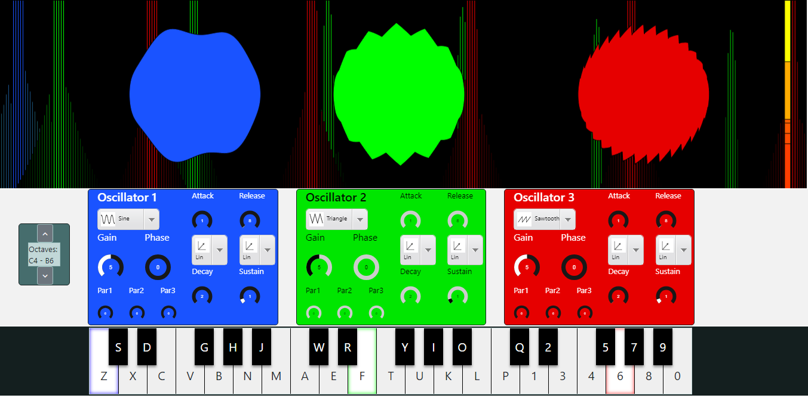

# Vynthesizer :musical_keyboard:

### Table of contents

1. [About](#about)
2. [Installation and usage](#installation-and-usage)
3. [Credits](#credits)
4. [License](#license)

## About
Vynthesizer is a university project for the course of **Sound Analysis Synthesis and Processing** of the **Computer Science and Engineering - Musical Acoustics** master degree of the **[Politecnico of Milan](https://www.polimi.it/)**.  
It is a simple web synthesizer made of three oscillators with an amplitude envelope filter, each of them guided by one octave of the keyboard. You can either produce monophonic sounds, clicking with the mouse the key.note you want, or use your computer keyboard to produce basic three note chords.  
While you are playing, the sounds you are producing are analyzed in real time to drive the animations on the display:
1. the three circles (one for each oscillators) follow the signal's amplitude and waveform;
2. behind the circles, a little spectrogram shows the spectrum of the three oscillator's sounds;
3. a little yellow bar, indicates where the majority of energy of the signal lies.  
